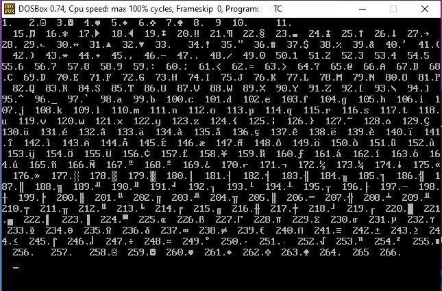
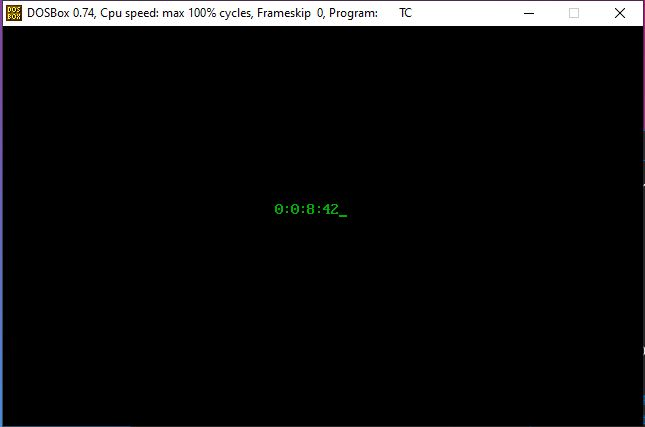
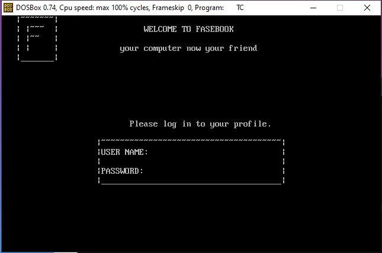
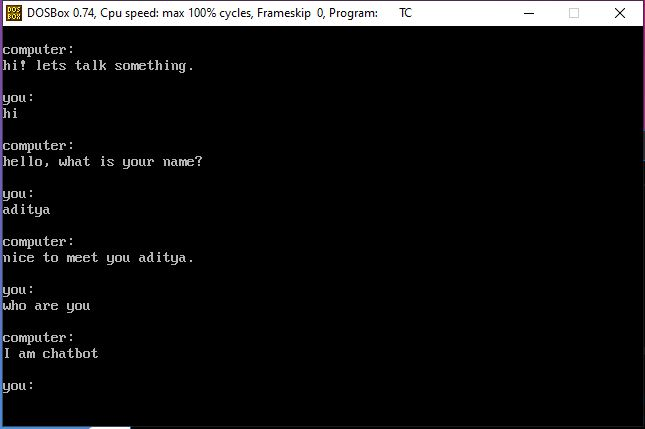
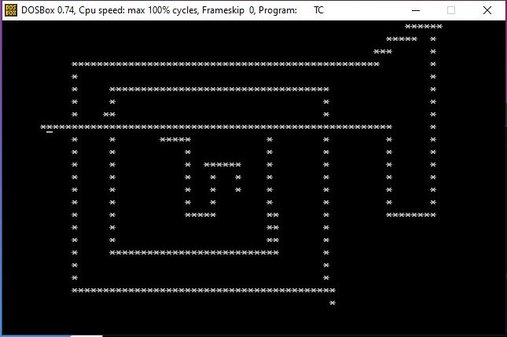
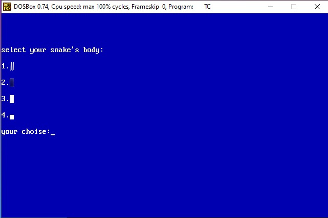
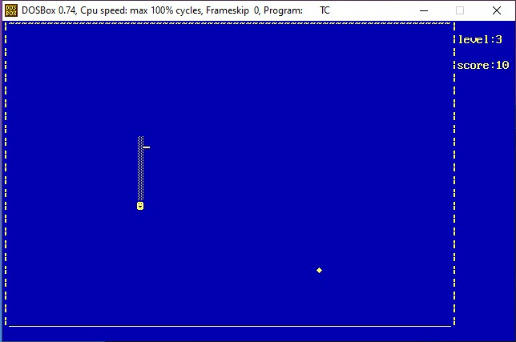
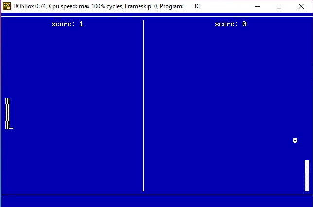

# 2D-games-with-simple-c-concepts

  

## 📌 Introduction
This repository mostly has fun projects created by me during my high school days using basic concepts of C++.
Mostly consists of 2D games created using simple C++ concepts. Can be helpful for enthusiastic students in high school who choose Computer Science subject with high hope

## ⭐INDEX:

#### 1. [CHARACTERS IN CPP](CPP_FILES/1__CHARACTERS_IN_CPP.CPP)
- This program allows you to explore all the symbols provided in C++ which can be used later to make 2D graphics.

#### 2. [STOPWATCH](CPP_FILES/2__STOPWATCH.CPP)
- A simple program to understand uses of loop and colours in C++.

#### 3. [CHATBOT](CPP_FILES/3__CHATBOT.CPP)
- A chatbot made by merely using strings manipulation functions and loops. This was a real fun project in the nascent stage.

#### 4. [PAINT USING ARROW KEYS](CPP_FILES/4__PAINT.CPP)
- A program that demostrates the use of goto(x,y) function. Using this you can draw rigid shapes [Square/Rectangle] using arrow keys. 

#### 4. [SNAKE GAME](CPP_FILES/5__SNAKE_GA.CPP)
- The one and only snake game that we have all played at some point in our life. Coding it from scratch using basics of C++ will be a real fun task for beginners.

#### 5. [PING PONG GAME](CPP_FILES/6__TENNIS.CPP)
- Used a concept of physics that net velocity is equal to the sum of velocity in x and y direction respectively. 

## 💥 How to Contribute?
- Take a look at the Existing Issues or create your own Issues!
- Fork the Repo and create a Branch for any Issue that you are working upon.
- Create a Pull Request which will be promptly reviewed and suggestions would be added to improve it.
- Add a screenshot of your program in ASSET folder, add description of your program in [README.md](README.md) with screenshots.

## LICENSE:
[MIT](LICENSE.md)
